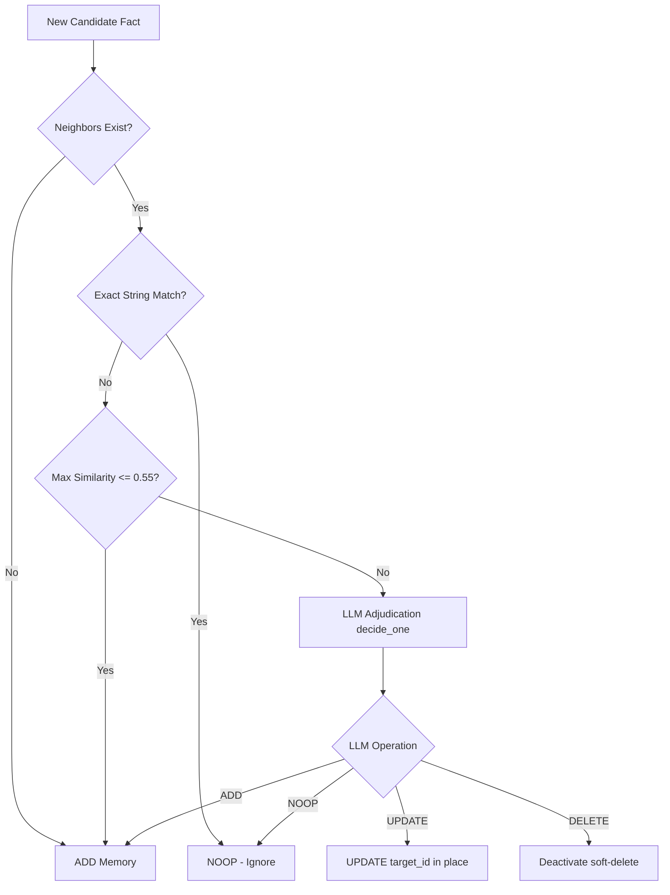

# Comparative Analysis: Ledger vs. Mem0

---

## 1. Architectural Overview

| Architectural Dimension | Ledger (Custom Implementation) | Mem0 (External Framework) |
| :--- | :--- | :--- |
| **Database Footprint** | Pure PostgreSQL + `pgvector`. Zero extra infrastructure dependencies. | Abstracted multi-DB wrapper (Qdrant, Pinecone, Chroma) + custom Graph DBs. |
| **Write Path Orchestration** | Deterministic pre-scrubbing $\rightarrow$ Structured Extraction $\rightarrow$ Heuristic Gating $\rightarrow$ LLM Adjudication. | Abstracted pipelines that feed raw dialogue to LLM parsers. |
| **State Tracking** | Immutable append-only `memory_events` audit table tracking every state transition. | Key-value state mutations in target vector index; no native audit trail. |
| **Read Path Retrieval** | Cosine vector query, then a **deterministic blended rerank** (relevance + category importance + recency + lexical overlap) with a relevance floor - no LLM in the hot path. | Standard $K$-Nearest Neighbor (KNN) vector similarity. |
| **PII Safety** | Hard deterministic filters (Regex + Luhn checksum validation) prior to LLM boundary. | Downstream prompt guardrails; no built-in deterministic validation. |

---

## 2. Write Path & Conflict Reconciliation

The core challenge of agentic memory is reconciling new observations with existing beliefs. Here is how both implementations approach this.

### Ledger's Reconciliation (Hybrid Deterministic + LLM)
Ledger optimizes for performance and cost by wrapping the LLM reconciler in a deterministic `gate()`:
1. **Cosine Similarity Check:** Retrieve the closest existing memories. If the highest similarity is below `0.55` (`SIM_ADD_BELOW`), Ledger skips the LLM entirely and immediately executes an `ADD`.
2. **Exact Normalization:** If the normalized string matches an existing memory, Ledger immediately executes a `NOOP` without calling the LLM.
3. **Adjudication:** The LLM is only called for the "gray zone" (similarity > 0.55 but not an exact match) to decide between `UPDATE` (merging/rewriting in place) or `DELETE` (removing obsolete facts).



### Mem0's Reconciliation (LLM-First)
Mem0 relies on a fully LLM-driven reconciliation parser. The incoming message is passed to an internal prompt wrapper that decides how to update the memory.
* **Trade-off:** Mem0 is highly flexible and can resolve complex, non-obvious relationships, but it pays a significant latency and token-cost penalty because it makes LLM calls for *every single interaction*, even when the facts are completely new or identical duplicates.

---

## 3. Transparency & Auditability (The Ledger)

In production customer support, auditability is a compliance requirement. If an agent uses a memory to make a decision, developers must be able to trace that memory's history.

```sql
-- Ledger's Immutable Audit Log Schema
CREATE TABLE IF NOT EXISTS memory_events (
    id          BIGSERIAL PRIMARY KEY,
    memory_id   UUID NOT NULL,
    op          TEXT NOT NULL, -- ADD, UPDATE, DELETE, EXPIRE
    old_text    TEXT,
    new_text    TEXT,
    source      TEXT,          -- The exact user message that caused the change
    created_at  TIMESTAMPTZ NOT NULL DEFAULT now()
);
```

### Why Ledger's Custom Implementation wins on compliance:
* **Provenance:** Every state change (`ADD`, `UPDATE`, `DELETE`) is recorded in the `memory_events` table along with the `source` text that triggered it. In the UI, clicking a fact queries this table to show the history.
* **Mem0 Limitations:** Mem0 performs destructive updates. When a memory is updated, the previous text is overwritten in the vector database. To build an audit trail in Mem0, developers must write custom wrappers around the library to log operations manually.

---

## 4. Privacy & PII Handling

AI memory must never store secrets (credit cards, passwords, OTPs).

* **Ledger (Deterministic):** Passes user input through `scrub.py` before it is tokenized or stored. The Luhn checksum algorithm verifies if a number sequence is actually a credit card to prevent redacting arbitrary order IDs (e.g. `ORD-2290` is kept, while `4111-1111-1111-1111` is scrubbed).
* **Mem0:** Relies on the LLM’s system instructions to ignore secrets. If a prompt-injection attack bypasses the instructions, Mem0 will extract and store the PII directly in the vector database.

---

## 5. Read Path: Contextual Reranking

Retrieving memories purely based on vector similarity (used by standard Mem0) fails when the customer's query is ambiguous.

* **Mem0 (Vector Search):** If the customer asks *"Where is my order?"*, a vector search retrieves memories containing the word "order". If the customer has multiple orders, it returns them based purely on mathematical similarity.
* **Ledger (Contextual Reranking):** Retrieves the top 15 vector matches for the query (contextualised with the customer's recent turns), then reranks them with a **deterministic blend** - cosine relevance + a category prior (open commitments and live issues outrank stable profile facts) + recency + light keyword overlap - and drops anything below a relevance floor. So for a customer whose open coffee-grinder refund is a `commitment`, that memory is elevated over an equally-similar background preference, and a stale one-off `episode` is demoted - all without an LLM in the retrieval hot path. Reserving the LLM for the write-path gray zone (and grounding) keeps recall fast, cheap, and reproducible.

---

## Summary for Stakeholders

Building a custom pipeline rather than importing Mem0 allows the system to:
1. **Reduce LLM Latency & Cost:** A deterministic `gate()` bypasses LLM reconciliation calls for clear-cut operations.
2. **Ensure GDPR/PII Compliance:** Deterministic scrubbing at the API edge ensures credit cards and OTPs never touch the database or third-party AI APIs.
3. **Provide Full Explainability:** The immutable event log makes every AI decision completely traceable, which is essential for audit reviews.
