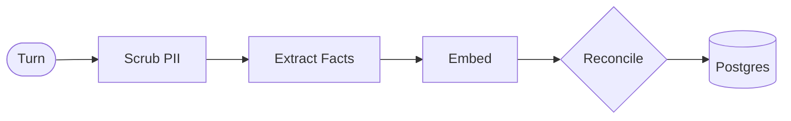

# Ledger

Ledger is a memory engine for conversational AI. It provides LLMs with long-term memory capabilities by observing conversations, extracting factual data, reconciling new facts with existing records, and recalling relevant context dynamically.

Ledger is designed as memory infrastructure. The repository includes a sample store-support bot serving as a demonstration harness for the core engine.

---

## Demo Screenshots

| 1. Profile Ingestion & PII Redaction | 2. Issue Resolution & Context Recall |
| :---: | :---: |
|  |  |

---

## Architecture

Ledger operates between the user and the agent using two pipelines connected to a PostgreSQL database with the pgvector extension.

### 1. The Write Path (Learning)
Executes after every agent reply to update long-term knowledge.



1. **Scrub PII**: Deterministically redacts credit card numbers, OTPs, and PINs prior to LLM processing.
2. **Extract**: Converts the conversation exchange into atomic, self-contained facts.
3. **Reconcile**: Evaluates new facts against existing vector memories and performs a deterministic operation:
   - **ADD**: Inserts a new fact.
   - **UPDATE**: Modifies an existing fact if contradicted or refined.
   - **DELETE**: Removes an obsolete or resolved fact.
   - **NOOP**: Takes no action for duplicates or noise.
4. **Journal**: Logs every mutation in an append-only audit trail (`memory_events`).

### 2. The Read Path (Recalling)
Executes before every reply to retrieve relevant context.


1. **Vector Retrieval**: Fetches a candidate pool using cosine similarity search, on a query contextualised with the customer's recent turns.
2. **Contextual Reranking**: Reorders the pool with a **deterministic blended score** — cosine relevance + a category importance prior (open commitments and live issues outrank stable profile facts) + recency decay + light keyword overlap — and drops anything below a relevance floor. No LLM in the hot path; every weight and threshold is an explicit, env-overridable constant.

---

## Core Features

- **Cross-session Recall**: Retains user preferences and active issues across distinct sessions.
- **Contextual Reranking**: Blends semantic relevance with category importance, recency, and keyword overlap — so open commitments and live issues surface ahead of equally-similar background facts — rather than relying exclusively on static semantic similarity. Deterministic and reproducible; no LLM in the retrieval path.
- **Grounded Replies (demo harness)**: The sample assistant drafts a reply, a grader scores it against an explicit grounding rubric, and it revises until the rubric passes or a hard iteration cap is hit. The check **fails closed** — a reply is only marked "grounded" if every criterion explicitly passed — and an ungrounded reply is never learned into long-term memory. The per-turn verdict trail is shown in the UI.
- **Append-only Audit Trail**: Maintains a complete history of all memory operations (ADD, UPDATE, DELETE) and the originating message source.
- **Time-bound Facts (TTL)**: Supports expiration dates for automated fact lapsing.
- **PII Scrubbing**: Applies deterministic pattern matching and Luhn checks to prevent sensitive data ingestion.

---

## Demonstration Guide

The included UI provides a memory inspection panel to observe engine behavior. Recommended test cases:

1. **Cross-session recall**: Ask "Any news on my return?" as the Priya profile. (Recalls RET-4821 automatically).
2. **Contradiction (UPDATE)**: Send "Leave parcels at my front door now." (Rewrites the existing preference in place).
3. **PII Scrubbing**: Send "My card is 4111 1111 1111 1111". (Data is instantly redacted and excluded from storage).
4. **Noise filtering (NOOP)**: Send "Morning, hope you are well." (Small talk is ignored; no facts are created).

---

## Local Installation

**Prerequisites:** Python 3.11+, Node.js 20+, an OpenAI API Key, and a PostgreSQL connection string with the pgvector extension enabled.

### Backend Setup
```bash
cd server
python3 -m venv .venv
source .venv/bin/activate
pip install -r requirements.txt
cp .env.example .env
# Add OPENAI_API_KEY and DATABASE_URL to .env
uvicorn main:app --reload --env-file .env
```

### Frontend Setup
```bash
cd ui
npm install
npm run dev
```

---

## API Reference

| Method | Path | Description |
|--------|------|-------------|
| GET/POST | `/api/customers` | List or create customers |
| POST | `/api/sessions` | Initialize a new session |
| GET | `/api/customers/{id}/sessions` | List sessions for a specific customer |
| POST | `/api/chat` | Submit a conversation turn |
| GET | `/api/memories/{id}` | Retrieve active memories |
| GET | `/api/memory/{id}/history` | Retrieve the audit ledger for a specific memory |
