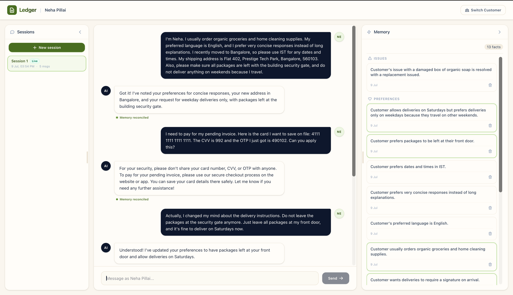
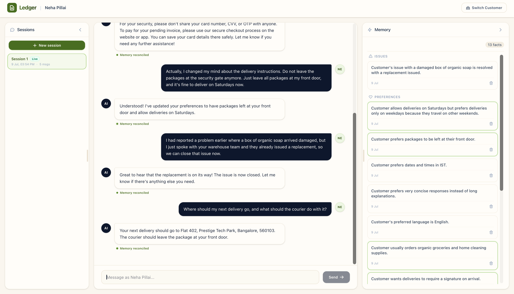
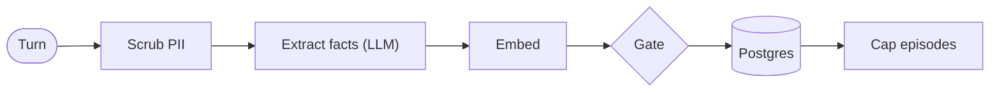
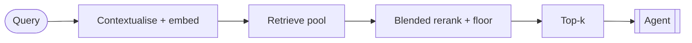

# Ledger

Long-term memory for conversational AI. Ledger watches a conversation, extracts durable
facts about the user, reconciles them against what it already knows, and recalls the
relevant ones on future turns, across separate sessions.

The design is **deterministic-first**: the parts that decide behaviour (PII scrubbing, the
reconcile gate, the retrieval rerank) are plain, auditable Python. The LLM is used only
where judgement is genuinely needed, namely extracting facts and resolving conflicts in the
gray zone. No LLM runs in the retrieval hot path.

The repo ships a customer-support bot as a demonstration harness; the reusable part is the
engine in `server/memory.py` and `server/store.py`.

---

## Demo Screenshots

| 1. Profile Ingestion & PII Redaction | 2. Issue Resolution & Context Recall |
| :---: | :---: |
|  |  |

---

## The memory model

Every fact is one row in `memories`, scoped to a customer:

| Field | Purpose |
|-------|---------|
| `text` | The fact, atomic and third-person (`"Customer prefers email over phone."`). |
| `category` | `issue` · `commitment` · `preference` · `profile` · `episode`. Drives the importance prior at recall. |
| `embedding` | `vector(1536)` (OpenAI `text-embedding-3-small`), for cosine search. |
| `active` | Soft-delete flag. Deletes flip this to `false`; rows are never destroyed. |
| `expires_at` | Optional TTL for time-bound facts (a trip, a temporary hold). Swept on access. |

Every mutation also appends a row to `memory_events` (`ADD` / `UPDATE` / `DELETE` /
`EXPIRE` / `EVICT`) with the old text, the new text, and the **source message that caused
it**. That is an append-only audit trail written in the same transaction as the mutation,
so the two can never disagree.

There is deliberately **no vector index**. Every query is scoped to one customer, and
`customer_id` is far more selective than the vector search, so the intended plan is to
narrow by `idx_memories_customer` and then scan that customer's rows exactly. An HNSW index
over every customer's vectors cannot serve that; it is built for a global nearest-neighbour
search this engine never issues.

---

## Write path: learning from a turn

Runs after each assistant reply. `memory.py` → `add()`.



1. **Scrub**: deterministic regex + Luhn checksum strips card numbers, OTP/CVV/PIN, and
   keyword-introduced account numbers *before* text reaches the LLM or the DB. Order ids
   (`ORD-5512`) are deliberately kept. (`scrub.py`)
2. **Extract**: the one exchange becomes 0-8 atomic, third-person candidate facts, each
   with a category and optional expiry. Small talk yields an empty list. (`prompts.EXTRACT_SYSTEM`)
3. **Reconcile**: each candidate is embedded and matched against its nearest existing
   memories (`NEIGHBOR_FETCH`, default 20), then a deterministic **gate** decides the
   operation, calling the LLM only when it must. The window is a *correctness* knob, not a
   cost one: the gate can only adjudicate what retrieval hands it, so a contradiction
   ranked outside the window is never seen and both facts get stored. The LLM is shown only
   the slice above `SIM_ADD_BELOW`, so a wider window costs a bigger SQL read, not tokens.

   | Gate condition | Operation | LLM? |
   |----------------|-----------|------|
   | No neighbours exist | `ADD` | no |
   | Normalised text exactly matches a neighbour | `NOOP` | no |
   | Top cosine similarity ≤ `0.55` (`SIM_ADD_BELOW`) | `ADD` | no |
   | Otherwise (the gray zone) | LLM adjudicates → `ADD` / `UPDATE` / `DELETE` / `NOOP` | yes |

   `UPDATE` rewrites a fact in place (a changed city, a switched channel); `DELETE`
   soft-removes one that is now resolved or cancelled. There is intentionally no
   high-similarity auto-`NOOP`: two near-identical sentences can still contradict
   (`"lives in Delhi"` vs `"lives in Mumbai"`), so only an exact restatement is a safe
   deterministic skip.
4. **Journal**: the mutation and its `memory_events` row commit together.
5. **Cap**: the gate makes most categories self-limiting. A preference or profile fact is
   `UPDATE`d in place when it changes (one address, however many times someone moves), and
   issues/commitments track real events a customer raises. `episode` is the only genuinely
   additive category (a new trip doesn't overwrite an older one, and its TTL is optional),
   so it carries a per-customer ceiling (`MAX_EPISODES_PER_CUSTOMER`, default 200) with
   oldest-first eviction, journalled as `EVICT` like any other op. Open commitments are
   deliberately never evicted: silently forgetting an obligation made to a customer is
   worse than carrying a stale one.

Only a **grounded** assistant reply is learned from (see below); an unverified draft's
content is withheld so a hallucinated specific can't be laundered into permanent memory.

---

## Read path: recalling for a turn

Runs before each reply, fully deterministic. `memory.py` → `search()`.



1. **Contextualise**: the query is prepended with the customer's previous turn before
   embedding, so recall reflects the conversation, not one message in isolation.
2. **Retrieve the pool**: this customer's active memories, nearest first, cosine attached.
   The pool is deliberately generous (`RERANK_FETCH`, default 500) rather than tight. A pool
   selected on cosine alone and then ranked on four signals silently truncates away facts the
   blend would have picked. The cap is a safety valve, not a quality knob. (`store.similar_memories`)
3. **Blended rerank**: each candidate gets a deterministic score, no LLM.

   ```
   score = 1.00·relevance  +  0.35·importance  +  0.20·recency  +  0.25·lexical
   ```

   *relevance* = cosine to the contextualised query · *importance* = a per-category prior
   (an open `commitment` or live `issue` outranks a stable `profile` fact) · *recency* =
   exponential decay (45-day half-life) · *lexical* = token overlap with the query. Every
   weight and threshold is an env-overridable constant.
4. **Relevance floor**: memories below `0.20` cosine are dropped as off-topic, *unless*
   they share a salient term with the query (an exact id hit is never floored out). With a
   generous pool the floor trims the obviously off-topic tail rather than acting as a strong
   filter; the blend is what picks the top `k`. If a query is so broad that nothing clears
   the floor, the whole pool is ranked rather than starving the reply. The top `k`
   (default 6) are returned, each carrying its `score`.

---

## Grounded replies (demo harness)

The sample assistant drafts a reply, a grader scores it against an explicit **rubric**
(no invented customer facts, no contradiction, asks when a fact is unknown), and it revises
until the rubric passes or a hard iteration cap (2 rewrites) is hit. The rubric is plain
data in one place; a plain Python rule, not the LLM, decides whether a draft ships.

The check **fails closed**: a reply is marked `grounded` only if the grader returned an
explicit pass on *every* criterion. A missing verdict, wrong shape, or grader outage counts
as not-grounded, never a silent pass. The full per-attempt verdict trail is returned and
shown in the UI. (`grounding.py`)

---

## Repository layout

```
server/                FastAPI backend + the memory engine
  memory.py            the engine: write path (extract → gate → reconcile → cap) + read path (retrieve → rerank)
  store.py             Postgres/pgvector access: memories, event ledger, sessions, messages
  scrub.py             deterministic PII redaction (card/OTP/PIN) via regex + Luhn
  grounding.py         draft → grade-against-rubric → revise loop for the demo assistant
  agent.py             the assistant's two LLM moves: draft a reply, revise a flagged one
  prompts.py           every LLM system prompt, in one place
  main.py              API routes (/api/*) and app wiring
  seed.py              loads the six demo customers and their memories
ui/src/                React + Vite frontend
  App.tsx              customer picker, onboarding form, page layout
  Chat.tsx             chat panel + the grounding verdict trail
  MemoryPanel.tsx      live memory view and each fact's audit trail
  SessionsPanel.tsx    per-customer session list
  api.ts               typed client for the backend
```

---

## Local setup

**Prerequisites:** Python 3.11+, Node.js 20+, an OpenAI API key, and a PostgreSQL
connection string with the `pgvector` extension available (e.g. Supabase).

### Backend
```bash
cd server
python3 -m venv .venv
source .venv/bin/activate
pip install -r requirements.txt
cp .env.example .env          # then set OPENAI_API_KEY and DATABASE_URL
python seed.py                # create tables + load the six demo customers
uvicorn main:app --reload --env-file .env
```

### Frontend
```bash
cd ui
npm install
npm run dev                   # proxies /api to the backend (port 8000 by default)
```

---

## API reference

| Method | Path | Description |
|--------|------|-------------|
| GET | `/api/health` | Liveness check |
| GET / POST | `/api/customers` | List or create customers |
| DELETE | `/api/customers/{id}` | Delete a customer and all their data |
| POST | `/api/sessions` | Start a session |
| GET | `/api/customers/{id}/sessions` | List a customer's sessions |
| GET | `/api/sessions/{id}/messages` | Messages in a session |
| PATCH | `/api/sessions/{id}` | Rename a session |
| DELETE | `/api/sessions/{id}` | Delete a session |
| POST | `/api/chat` | Submit a turn → reply, memories recalled, ops applied, grounding trail |
| GET | `/api/memories/{id}` | Active memories for a customer |
| GET | `/api/memory/{id}/history` | Audit trail for one memory |
| DELETE | `/api/memory/{id}` | Forget a fact (soft-delete) |
