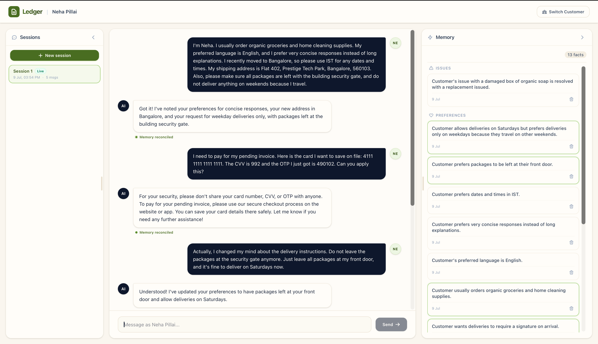
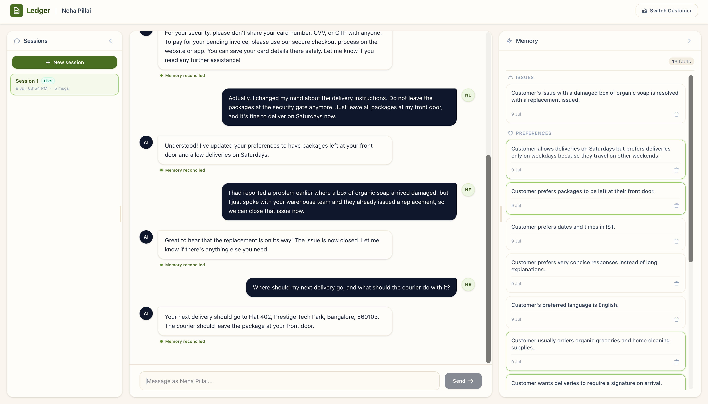
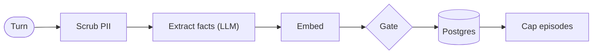
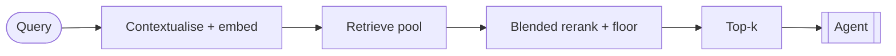

# Ledger

Long-term memory for conversational AI, deterministic where it counts and auditable throughout.

Ledger watches a conversation, pulls out durable facts about the user, reconciles them against
what it already knows, and recalls the relevant ones on later turns, even across separate
sessions. Every fact it holds can be traced back to the message that created it. Facts get
updated when the truth changes, deleted when they stop being true, and never store secrets.

The guiding idea is to stay deterministic wherever behaviour is decided. PII scrubbing, the
reconcile gate, the retrieval rerank, and the grounding pass/fail are all plain Python you can
read and test. The LLM only does the two jobs that actually need judgement: extracting facts,
and resolving genuine conflicts. Nothing calls an LLM on the retrieval path.

The repo ships a customer-support bot as a demo, but the reusable part is the engine in
[`server/memory.py`](server/memory.py) and [`server/store.py`](server/store.py).

---

## Demo screenshots

| 1. Profile ingestion and PII redaction | 2. Issue resolution and context recall |
| :---: | :---: |
|  |  |

---

## What makes it different

Most memory layers (mem0, Zep, LangMem, Letta) run some version of extract, embed, reconcile,
recall. Ledger's take is that for a system that records what you believe about a person,
auditability and determinism are the point, not overhead. Five things follow from that:

| Property | What it means | Why it's uncommon |
|----------|---------------|-------------------|
| **Provenance in the same transaction** | Every `ADD`, `UPDATE`, `DELETE`, `EXPIRE`, and `EVICT` is written to an event log in the same transaction as the change itself, along with the message that caused it. The log can never drift from the memory table. | History usually lives elsewhere, not mutation-level, source-attributed, and transactionally tied to the data. |
| **Writes gated on grounding** | A reply is only learned from if it passed an explicit grounding check. An unverified draft's content is withheld, so a made-up detail can't sneak into permanent memory. | Most systems extract facts from whatever the assistant said, hallucinations included. |
| **Deterministic recall** | Ranking is a plain weighted blend in Python, every weight an env-overridable constant, and each recalled fact carries its score. You can pin it in a unit test with no database and no API key. | Recall order usually comes from opaque vector search, or an LLM in the loop. |
| **PII stripped before the model** | A regex and Luhn filter removes cards, OTP/CVV/PIN, account numbers, SSNs, emails, and phone numbers before any text reaches the LLM or the store. | Redaction, when it exists, tends to be best-effort or trusted to the model. |
| **Point-in-time reconstruction** | Because the log is append-only and complete, "what did we believe about this customer on date X" is answered by replaying it. No separate temporal store. | This normally needs a dedicated temporal graph database. |

There's an honest comparison, including what Ledger doesn't do, in [How it compares](#how-it-compares).

---

## The memory model

Every fact is one row in `memories`, scoped to a customer:

| Field | Purpose |
|-------|---------|
| `text` | The fact, atomic and third-person ("Customer prefers email over phone."). |
| `category` | One of `issue`, `commitment`, `preference`, `profile`, `episode`. Sets the importance prior at recall. |
| `embedding` | `vector(1536)` (OpenAI `text-embedding-3-small`), for cosine search. |
| `active` | Soft-delete flag. Deletes flip this to `false`; rows are never destroyed. |
| `expires_at` | Optional TTL for time-bound facts (a trip, a temporary hold). Swept on access. |

Every change also appends a row to `memory_events` (`ADD`, `UPDATE`, `DELETE`, `EXPIRE`,
`EVICT`) with the old text, the new text, and the message that caused it. It's written in the
same transaction as the change, so the two can never disagree, and it's the full history that
point-in-time state is rebuilt from.

There's deliberately no vector index. Every query is scoped to one customer, and `customer_id`
is far more selective than the vector search, so the plan we want is: narrow by
`idx_memories_customer`, then scan that customer's rows exactly. An HNSW index over every
customer's vectors can't serve that; it's built for a global nearest-neighbour search this
engine never runs. Worse, pgvector defaults `hnsw.iterative_scan` to off, so an HNSW scan
combined with a selective filter that isn't in the index (our `customer_id`) can quietly return
fewer rows than the `LIMIT` asked for, which would degrade reconciliation to append-only. This
trade-off does have a scale ceiling; see [Demo vs production](#demo-vs-production).

---

## Write path: learning from a turn

Runs after each assistant reply. [`memory.py`](server/memory.py) `add()`.


```mermaid
flowchart LR
    T(["Turn"]) --> S["Scrub PII"] --> X["Extract facts (LLM)"] --> E["Embed"] --> G{"Gate"} --> DB[("Postgres")] --> C["Cap episodes"]
```

1. **Scrub.** A regex and Luhn checksum strips card numbers, OTP/CVV/PIN, keyword-introduced
   account numbers, SSNs, emails, and unambiguous phone numbers before text reaches the LLM or
   the DB. Order ids like `ORD-5512` and bare local digit runs are kept on purpose: they look
   just like tracking numbers, so they're only redacted when something disambiguates them.
   ([`scrub.py`](server/scrub.py))
2. **Extract.** The one exchange becomes 0 to 8 atomic, third-person candidate facts, each with
   a category and an optional expiry. Small talk yields an empty list. It fails open: a
   malformed extraction call learns nothing this turn rather than crashing it.
   (`prompts.EXTRACT_SYSTEM`)
3. **Reconcile.** Each candidate is embedded and matched against its nearest existing memories
   (`NEIGHBOR_FETCH`, default 20), then a deterministic gate decides the operation and only
   calls the LLM when it has to. The window is a correctness knob, not a cost one: the gate can
   only judge what retrieval hands it, so a contradiction ranked outside the window is never
   seen and both facts get stored. The LLM only sees the slice above `SIM_ADD_BELOW`, so a wider
   window costs a bigger SQL read, not more tokens.

   | Gate condition | Operation | LLM? |
   |----------------|-----------|------|
   | No neighbours exist | `ADD` | no |
   | Normalised text exactly matches a neighbour | `NOOP` | no |
   | Top cosine similarity is at or below `0.55` (`SIM_ADD_BELOW`) | `ADD` | no |
   | Otherwise (the gray zone) | LLM decides: `ADD`, `UPDATE`, `DELETE`, or `NOOP` | yes |

   `UPDATE` rewrites a fact in place (a changed city, a switched channel); `DELETE` soft-removes
   one that's resolved or cancelled. There's intentionally no high-similarity auto-`NOOP`: two
   near-identical sentences can still contradict ("lives in Delhi" vs "lives in Mumbai"), so
   only an exact restatement is a safe deterministic skip.
4. **Journal.** The change and its `memory_events` row commit together.
5. **Cap.** The gate keeps most categories self-limiting. A preference or profile fact is
   updated in place when it changes; issues and commitments track real events a customer raises.
   `episode` is the only genuinely additive category, so it gets a per-customer ceiling
   (`MAX_EPISODES_PER_CUSTOMER`, default 200) with oldest-first eviction, logged as `EVICT`.
   Open commitments are never evicted, because silently forgetting a promise made to a customer
   is worse than carrying a stale one.

Only a grounded reply is learned from (see [Grounded replies](#grounded-replies-demo-harness)),
so an unverified draft's content is withheld and a made-up detail can't become permanent memory.
Learning is best-effort and kept separate from the response: an extraction or embedding outage
means "learned nothing this turn", never a 500 after the customer already has their reply.

---

## Read path: recalling for a turn

Runs before each reply, fully deterministic. [`memory.py`](server/memory.py) `search()`.


```mermaid
flowchart LR
    M(["Query"]) --> C["Contextualise + embed"] --> H["Retrieve pool"] --> RK["Blended rerank + floor"] --> TOP["Top-k"] --> AG[["Agent"]]
```

1. **Contextualise.** The query is prepended with the customer's previous turn before embedding,
   so recall reflects the conversation and not one message in isolation.
2. **Retrieve the pool.** This customer's active memories, nearest first, with cosine attached.
   The pool is deliberately generous (`RERANK_FETCH`, default 500) rather than tight: picking
   the pool on cosine alone and then ranking on four signals would quietly drop facts the blend
   would have chosen. The cap is a safety valve, not a quality knob. If retrieval fails (an
   embedding outage, a DB blip), recall fails soft and the turn is answered with no recalled
   memories rather than erroring.
3. **Blended rerank.** Each candidate gets a deterministic score, no LLM:

   ```
   score = 1.00*relevance + 0.35*importance + 0.20*recency + 0.25*lexical
   ```

   where *relevance* is cosine to the contextualised query, *importance* is a per-category prior
   (an open commitment or live issue outranks a stable profile fact), *recency* is exponential
   decay with a 45-day half-life, and *lexical* is token overlap with the query. Every weight and
   threshold is an env-overridable constant.
4. **Relevance floor.** Memories below `0.20` cosine are dropped as off-topic, unless they share
   a salient term with the query (an exact id hit is never floored out). With a generous pool the
   floor just trims the obviously off-topic tail; the blend is what picks the top `k` (default
   6). If a query is so broad that nothing clears the floor, the whole pool is ranked rather than
   returning nothing.

---

## Grounded replies (demo harness)

The sample assistant drafts a reply, a grader scores it against an explicit rubric (no invented
customer facts, no contradiction, asks when a fact is unknown), and it revises until the rubric
passes or it hits a hard cap of two rewrites. The rubric is plain data in one place, and a plain
Python rule, not the LLM, decides whether a draft ships.

The check fails closed: a reply is marked `grounded` only if the grader returned an explicit
pass on every criterion. A missing verdict, a wrong shape, or a grader outage all count as
not-grounded, never a silent pass. The full per-attempt verdict trail is returned and shown in
the UI. ([`grounding.py`](server/grounding.py))

---

## Point-in-time recall

Since the event log is append-only and complete, a customer's memory at any past moment is a
pure function of the events up to that moment. `store.memories_as_of()` replays them: a memory's
most recent event on or before `T` decides whether it was alive (an `ADD` or `UPDATE`) or gone
(a `DELETE`, `EXPIRE`, or `EVICT`), and rebuilds exactly what Ledger believed then. That's
bitemporal recall with no separate temporal store to keep in sync, because the log already is
the history.

```bash
curl "http://localhost:8000/api/customers/priya_sharma/memories-as-of?t=2026-07-01T00:00:00Z"
```

---

## Guarantees and invariants

- The log and the memory table can never disagree, because every change and its audit row commit
  in one transaction (updates take a `FOR UPDATE` lock to avoid a race with a concurrent delete).
- No hallucination gets learned, because only replies that pass the grounding rubric are used.
- No LLM sits on the retrieval path, so recall is deterministic and reproducible.
- PII never reaches the model or the store; it's stripped at the boundary, before extraction.
- Growth is bounded, via self-limiting categories plus an episode cap, and open commitments are
  never silently evicted.
- Every fact is explainable: traceable to its source message, and reconstructable at any past
  time.
- It degrades gracefully. Recall fails soft, learning is isolated and best-effort, the embedding
  dimension is checked at the boundary, and OpenAI calls have an explicit timeout and retries.

---

## Configuration

Everything is an environment variable with a sensible default. See
[`server/.env.example`](server/.env.example) for the full annotated list. The knobs that shape
behaviour:

| Variable | Default | Controls |
|----------|---------|----------|
| `OPENAI_API_KEY` | required | |
| `DATABASE_URL` | required | Postgres with pgvector. |
| `LEDGER_CHAT_MODEL` | `gpt-4o` | Extraction, reconciliation, and agent model. |
| `LEDGER_EMBED_MODEL` | `text-embedding-3-small` | Embedding model. |
| `LEDGER_EMBED_DIM` | `1536` | Vector width. Must match the `vector(N)` column. |
| `LEDGER_OPENAI_TIMEOUT` | `30` | Per-call timeout in seconds. |
| `LEDGER_OPENAI_MAX_RETRIES` | `2` | Retries on transient failures. |
| `LEDGER_SIM_ADD_BELOW` | `0.55` | Below this cosine, a candidate is a deterministic `ADD`. |
| `LEDGER_NEIGHBOR_FETCH` | `20` | Reconciliation window (a correctness knob). |
| `LEDGER_MAX_EPISODES` | `200` | Per-customer ceiling on the one unbounded category. |
| `LEDGER_RERANK_FETCH` | `500` | Recall candidate pool (a safety valve, not a quality knob). |
| `LEDGER_RELEVANCE_FLOOR` | `0.20` | Minimum cosine to count as on-topic (keyword hits bypass). |
| `LEDGER_W_RELEVANCE`, `_IMPORTANCE`, `_RECENCY`, `_LEXICAL` | `1.0`, `0.35`, `0.20`, `0.25` | Blend weights. |
| `LEDGER_RECENCY_HALFLIFE_DAYS` | `45` | Age at which the recency signal halves. |
| `LEDGER_LOG_LEVEL` | `INFO` | Server log level. |

---

## Demo vs production

This repo runs end to end, and it's honest about being a reference implementation and demo. The
engine is production-shaped; the surface around it makes demo-friendly choices you'd change
before putting it in front of real users.

| Area | In this repo | For production |
|------|--------------|----------------|
| **Auth and multi-tenancy** | None. `customer_id` is a client-supplied string and every route is open. | Put auth in front and map the authenticated user to `customer_id`. Never let the client name the tenant. |
| **Learning latency** | Learning runs synchronously so the UI can show this turn's ops. The endpoint already isolates it from the response. | Move `memory.add(...)` to a background worker or queue and return the reply right away. |
| **Retrieval at scale** | Exact per-customer scan; fine up to roughly a few thousand active memories per customer. | Past that, add a per-customer partial vector index or partition `memories` by `customer_id`. The no-global-index argument still holds within a partition. |
| **Schema migrations** | Idempotent `CREATE ... IF NOT EXISTS` plus best-effort `ALTER`s, logged. | Adopt a versioned migration tool such as Alembic. |
| **Right to erasure** | `delete_customer` hard-deletes everything; per-fact `forget()` soft-deletes and keeps the log history (provenance vs erasure). | Add a hard-forget that purges the memory row and its `memory_events` when compliance needs it. |
| **Edge concerns** | No rate limiting, default CORS, secrets via env. | Add rate limiting, tighten CORS, and use a secrets manager. |
| **Prompt-injection surface** | Recalled memory text is rendered into the agent's system prompt. The blast radius is one customer's own future turns, since memory is per-customer. | Keep the memory block clearly delimited as data, and consider a policy check on stored content. |

---

## How it compares

An honest read against the field. Ledger's edge is provenance, determinism, and the
grounding gate on writes. It's intentionally not a graph or agentic-memory framework.

| System | Its strength | What Ledger has that it doesn't | What it has that Ledger doesn't |
|--------|--------------|----------------------------------|----------------------------------|
| **mem0** | Provider-agnostic, optional graph memory, user/session/agent scopes. | Same-transaction provenance, grounding-gated writes, deterministic rerank, built-in PII scrub. | Pluggable LLM/embedder/vector store, graph traversal, a managed platform. |
| **Zep (Graphiti)** | Bitemporal knowledge graph, typed entities and edges, hybrid search. | Much simpler ops (just Postgres), deterministic recall, mutation-level audit, the grounding gate. | A real graph and a richer temporal query surface. Ledger reconstructs point-in-time but stores flat per-customer facts, not entities and relations. |
| **LangMem** | Semantic/episodic/procedural typing, agent-callable memory tools, background consolidation. | Auditability, reproducible reconciliation, fail-closed grounding, a self-contained running system. | Procedural memory, memory-as-a-tool, summarising consolidation. |
| **Letta / MemGPT** | Self-editing in-context memory, context paging, shared agent memory. | Auditable, deterministic memory a hallucination can't rewrite, and a clean engine/agent split. | Agent-managed memory and virtual context management. |

The clearest next steps (entity links between facts, memory consolidation, pluggable providers)
are in [Limitations and roadmap](#limitations-and-roadmap). Each is weighed against the
deterministic ethos rather than added just for parity.

---

## Repository layout

```
server/                FastAPI backend plus the memory engine
  memory.py            the engine: write path (extract, gate, reconcile, cap) and read path (retrieve, rerank)
  store.py             Postgres/pgvector access: memories, the event log, point-in-time reconstruction, sessions
  scrub.py             deterministic PII redaction (card/OTP/PIN/account/SSN/email/phone) via regex and Luhn
  grounding.py         draft, grade against the rubric, revise loop for the demo assistant
  agent.py             the assistant's two LLM moves: draft a reply, revise a flagged one
  prompts.py           every LLM system prompt, in one place
  main.py              API routes (/api/*) and app wiring
  seed.py              loads the six demo customers (idempotent; --reset to wipe first)
  tests/               deterministic-core tests, run with no DB and no API key
ui/src/                React and Vite frontend
  App.tsx              customer picker, onboarding form, page layout
  Chat.tsx             chat panel plus the grounding verdict trail
  MemoryPanel.tsx      live memory view and each fact's audit trail
  SessionsPanel.tsx    per-customer session list
  api.ts               typed client for the backend
Dockerfile             multi-stage build: bundles the UI, serves it behind the API
docker-compose.yml     turn-key local stack: pgvector plus the server
```

---

## Local setup

You'll need Python 3.11+, Node.js 20+, an OpenAI API key, and a PostgreSQL connection string
with the pgvector extension available (Supabase works).

### Option A: Docker (turn-key)

```bash
OPENAI_API_KEY=sk-... docker compose up --build
docker compose exec server python seed.py     # load the six demo customers
# open http://localhost:8000
```

### Option B: run the pieces directly

Backend:

```bash
cd server
python3 -m venv .venv
source .venv/bin/activate
pip install -r requirements.txt
cp .env.example .env          # then set OPENAI_API_KEY and DATABASE_URL
python seed.py                # create tables and load the six demo customers (idempotent)
uvicorn main:app --reload --env-file .env
```

Frontend:

```bash
cd ui
npm install
npm run dev                   # proxies /api to the backend (port 8000 by default)
```

### Tests

The deterministic core runs with no database and no API key. Every LLM, embedding, and DB call
is stubbed, which is exactly what the deterministic design buys you:

```bash
cd server
.venv/bin/python -m pytest tests/ -q
```

---

## API reference

| Method | Path | Description |
|--------|------|-------------|
| GET | `/api/health` | Liveness (process up). |
| GET | `/api/ready` | Readiness (can reach Postgres); returns 503 if not. |
| GET / POST | `/api/customers` | List or create customers. |
| DELETE | `/api/customers/{id}` | Delete a customer and all their data. |
| POST | `/api/sessions` | Start a session. |
| GET | `/api/customers/{id}/sessions` | List a customer's sessions. |
| GET | `/api/sessions/{id}/messages` | Messages in a session. |
| PATCH | `/api/sessions/{id}` | Rename a session. |
| DELETE | `/api/sessions/{id}` | Delete a session. |
| POST | `/api/chat` | Submit a turn: reply, memories recalled, ops applied, grounding trail. |
| GET | `/api/memories/{id}` | Active memories for a customer. |
| GET | `/api/customers/{id}/memories-as-of?t=<iso>` | Point-in-time recall reconstructed from the log. |
| GET | `/api/memory/{id}/history` | Audit trail for one memory. |
| DELETE | `/api/memory/{id}` | Forget a fact (soft-delete). |
]]
